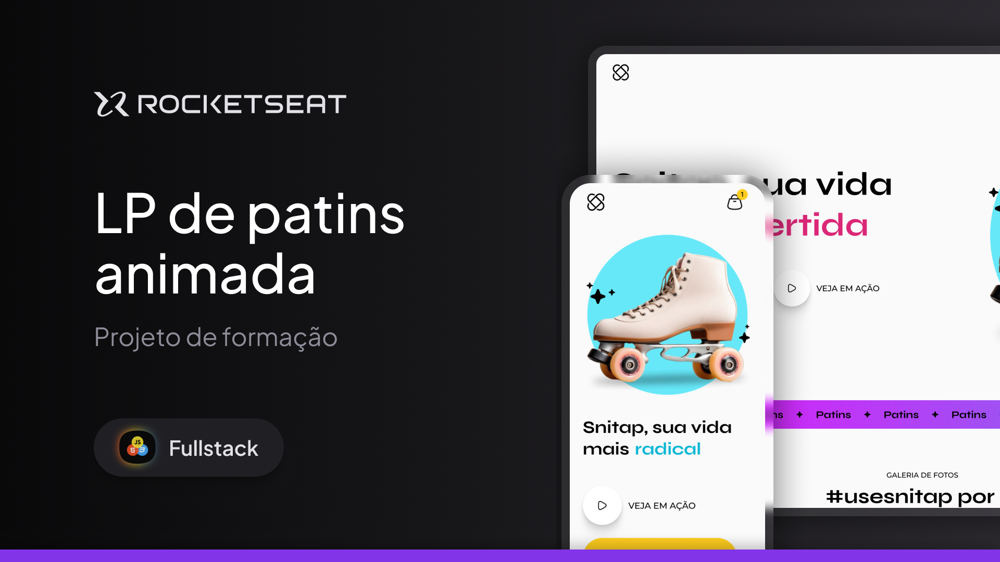

# Snitap - Patins

## 🖼️ Prévia do Projeto

---

## 💼 Sobre o Projeto

O **Snitap - Patins Animada** é um projeto de landing page focado em **animações** e **responsividade**, desenvolvido com base no curso da Rocketseat.  
O objetivo principal é recriar o design disponível no **Figma**, garantindo uma experiência de usuário fluida e animada que se adapta perfeitamente a qualquer dispositivo.

## 🎯 Objetivo do Projeto

O foco principal deste projeto é a prática e o domínio de:

- **HTML Semântico**: Estrutura da página com o uso correto das tags HTML para uma melhor acessibilidade e otimização.
- **CSS Avançado**: Utilização de técnicas modernas de CSS, como Flexbox, Grid Layout, e o uso de pseudo-elementos para criar um design visualmente atraente.
- **Animações e Transições**: Implementação de animações CSS para dar vida à página, com foco em efeitos de rolagem, movimento de elementos e transições de cor.
- **Responsividade**: Assegurar que o design seja totalmente responsivo e funcione perfeitamente em telas de diferentes tamanhos, de desktops a smartphones.

---

## 💻 Tecnologias Utilizadas

- **HTML5** → Estruturação semântica da página.
- **CSS3** → Estilização e animações (keyframes, animation-timeline, etc).

---

## ✨ Animações e Efeitos Principais

- **Animação do Título** → O texto _radical, divertida, saudável e radical_ se alterna no título principal com um efeito de slide.
- **Efeito de Rolagem do Banner** → Banner no meio da página rola horizontalmente de forma infinita.
- **Animação de Fundo Gradiente** → Gradiente do banner muda suavemente de cor.
- **Transição de Escala e Deslizamento** → Imagens da galeria “flutuam” ao passar o cursor.
- **Efeitos de Deslize na Seção Hero** → Patins, elipse e estrelas entram com transição de deslizamento.
- **Transição na Galeria** → Imagens aparecem suavemente ao rolar a página.

---

### 👨‍💻 Autor

Desenvolvido por Wigor.  
Projeto fictício com fins educacionais.
